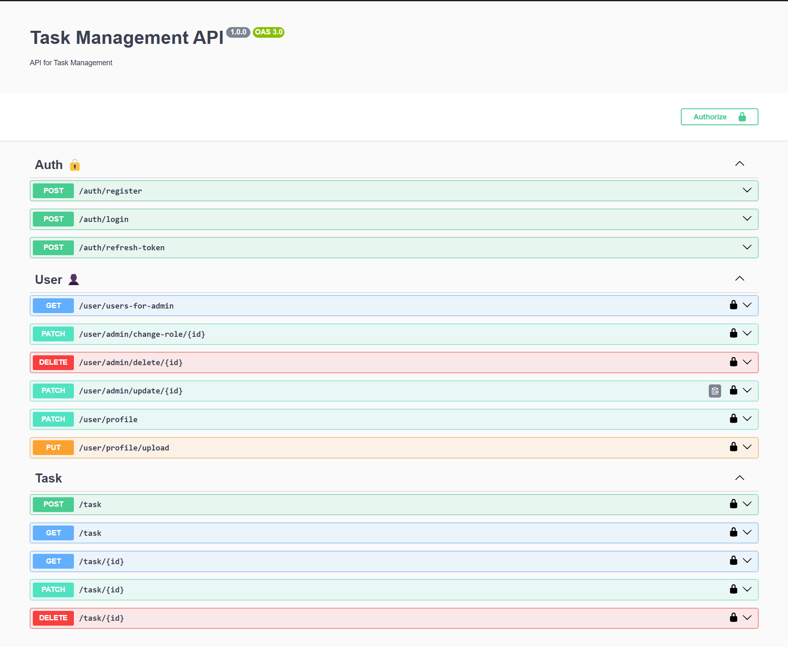

# Task Management API

A powerful and scalable task management system built with **NestJS**, **TypeORM**, and **MySql**. This API allows users to manage their tasks efficiently, with features like authentication, task creation, updates, deletions, and pagination.

## Features

- **Authentication & Authorization**: Secure user registration and login with JWT authentication.
- **User Management**: Role-based access control, profile management, and admin functionalities.
- **Task Management**:
  - Create, read, update, and delete personal tasks.
  - Attachment upload support with secure file storage.
  - Ownership validation to prevent unauthorized modifications.
- **Pagination**: Optimized pagination for retrieving users and tasks.

## Installation

1. Clone the repository:
   ```bash
   git clone https://github.com/Hossein-Falah/task-management.git
   ```
2. Navigate to the project directory:
   ```bash
   cd task-management
   ```
3. Install dependencies:
   ```bash
   npm install
   ```
4. Create a **.env** file and configure your environment variables:
   ```env
    APP_PORT=3000
    DOC_PATH=/api/docs
    APP_URL=http://localhost:3000

    DB_PORT=3306
    DB_HOST=localhost
    DB_NAME=task_management
    DB_USERNAME=root
    DB_PASSWORD=******

    JWT_ACCESS_SECRET=your-secret-key
    JWT_ACCESS_EXPIRES_IN=1h
    JWT_REFRESH_SECRET=your-secret-key
    JWT_REFRESH_EXPIRES_IN=7d
   
   ```

6. Start the application:
   ```bash
   npm run start:dev
   ```

## Preview Task Management Api



## API Documentation

Swagger API documentation is available at:
```
http://localhost:3000/api/docs
```

## Usage

- **User Registration & Authentication**: Register new users and generate access tokens.
- **Task CRUD Operations**:
  - `POST /tasks` - Create a new task
  - `GET /tasks` - Retrieve user's tasks with pagination
  - `GET /tasks/:id` - Retrieve a specific task (ownership validated)
  - `PUT /tasks/:id` - Update a task
  - `DELETE /tasks/:id` - Delete a task

## Contributing

1. Fork the repository.
2. Create a new feature branch: `git checkout -b feature/your-feature`
3. Commit your changes: `git commit -m 'feat: add new feature'`
4. Push the branch: `git push origin feature/your-feature`
5. Open a pull request.

## License

This project is licensed under the **MIT License**. Feel free to use and modify it.

## Author

Developed by **Hossein-Falah** 🚀

